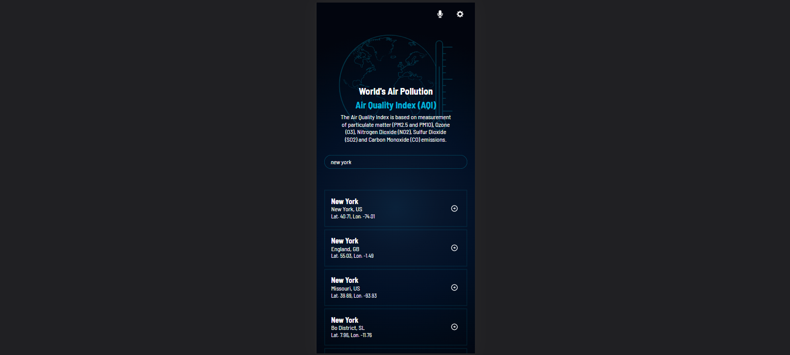
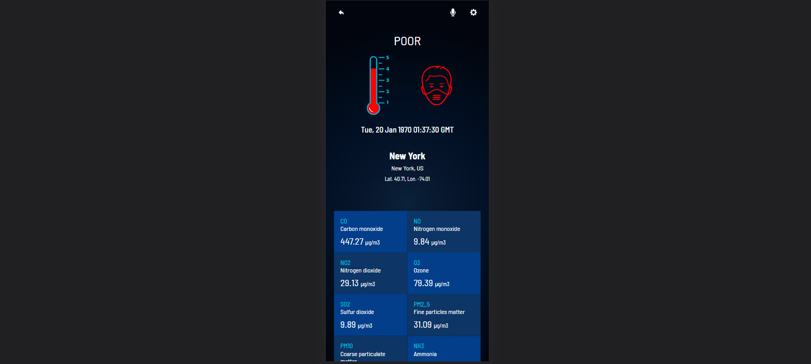

# Air Pollution
> The air pollution web page offers users information on the Air Quality Index (AQI) of the world cities and the detailed measurement of each polluting substance used to measure said AQI. Users can search by city name.

## Features

The website displays air pollution information using react components and redux store to:

- Navigation between two pages, home and contamination details.
- Users can start a search by entering the city name in the search bar on the home page, which will display a list of matching cities.
- Users can view the detailed information on air pollution by clicking the arrow button located near to each city.
- The details page shows:
  - The air quality index information using international standard colors.
  - The city location information.
  - The forecast of air pollution for the next 24 hours.
  - The forecast of air pollution for the next 5 days.
  - A table with the measurement of each polluting substance.
- The user can return to the home page by clicking the back button.
- The website retrieves city and air pollution data from two different third-party APIs.

## Built With

- JavaScript
- React
- Redux
- SCSS
- Webpack

## Live Demo

[World's air pollution](https://air-pollution.fly.dev/)

## Link loom video

[Presentation](https://www.loom.com/share/de3fa4a29a424f459fa1f2ba54a36fe0)

## Getting Started

To get a local copy up and running follow these simple example steps.

### Prerequisites

- Have `git` installed on your local computer.

### Install

- Clone this repository to your local computer. Choose the location you prefer.
- Run the command `npm install` to install all project's dependencies.

### Usage

- To begin the development, run the command `npm run dev`.
- The homepage will automatically open in the browser, otherwise open it manually using `http://localhost:3000`.

### Deployment

- To create a production bundle, run the command `npm run build`.
- Deploy the `build` folder.

## Authors

👤 **Gabriela Sánchez Espirilla**

- GitHub: [@gabyse1](https://github.com/gabyse1)
- LinkedIn: [gabyse](https://www.linkedin.com/in/gabyse/)
- Twitter: [@gse_sd](https://twitter.com/gse_sd)

## 🤝 Contributing

Contributions, issues, and feature requests are welcome!

Feel free to check the [issues page](../../issues/).

## Show your support

Give a ⭐️ if you like this project!

## Acknowledgments

- Linters: [Microverse](https://github.com/microverseinc/linters-config)
- Basic design idea: [Nelson Sakwa](https://www.behance.net/sakwadesignstudio)
- Faces design: [jussilanet](https://jussilanet.com/CU-HWS/css/aqi/?ND)

## 📝 License

This project is [MIT](./LICENSE) licensed.
